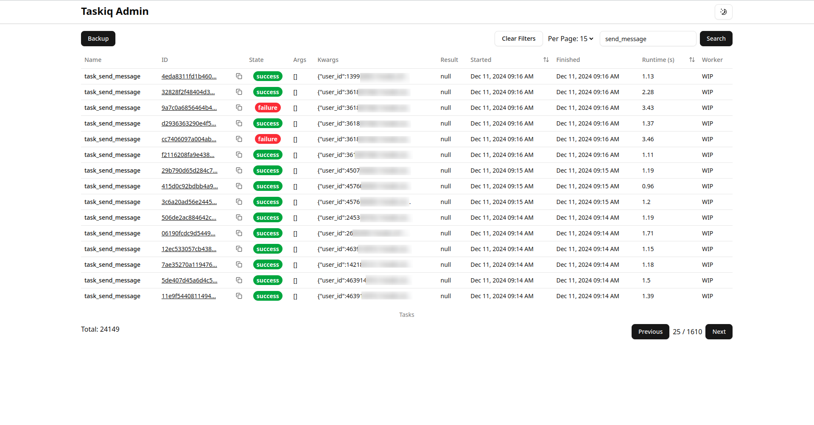
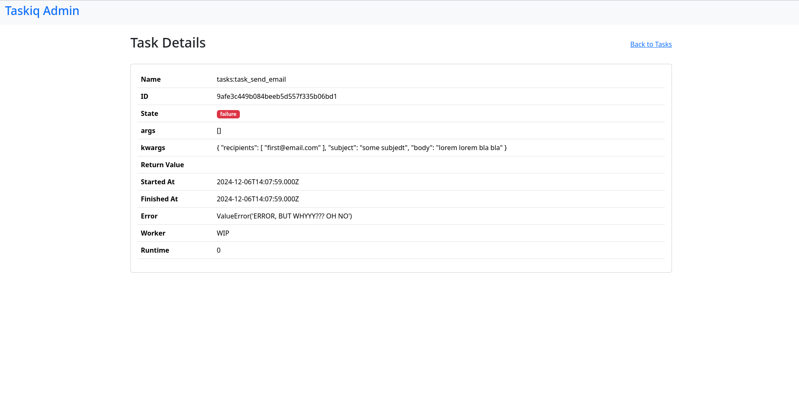

## Broker-agnostic admin panel for Taskiq

Standalone admin panel with all data stored in SQLite database


- [Broker-agnostic admin panel for Taskiq](#broker-agnostic-admin-panel-for-taskiq)
  - [Previews](#previews)
  - [Usage](#usage)
  - [Docker Compose Example](#docker-compose-example)
  - [Task States](#task-states)
  - [Development](#development)

### Previews
Tasks Page | Task Details Page
:-------------------------:|:-------------------------:
 | 

### Usage

1) Add this middleware to your project:

```python
import asyncio
import logging
import aiohttp
from typing import Any
from urllib.parse import urljoin
from datetime import datetime, UTC

from taskiq import TaskiqMiddleware, TaskiqResult, TaskiqMessage

logger = logging.getLogger(__name__)


class TaskiqAdminMiddleware(TaskiqMiddleware):
    def __init__(
        self,
        url: str,
        api_token: str,
        taskiq_broker_name: str | None = None,
    ):
        super().__init__()
        self.url = url
        self.api_token = api_token
        self.__ta_broker_name = taskiq_broker_name
        self._pending: set[asyncio.Task[Any]] = set()
        self._client: aiohttp.ClientSession | None = None

    @staticmethod
    def _now_iso() -> str:
        return datetime.now(UTC).replace(tzinfo=None).isoformat()

    async def startup(self):
        self._client = aiohttp.ClientSession(
            timeout=aiohttp.ClientTimeout(total=5),
        )

    async def shutdown(self):
        if self._pending:
            await asyncio.gather(*self._pending, return_exceptions=True)
        if self._client is not None:
            await self._client.close()

    def _spawn_request(self, endpoint: str, payload: dict[str, Any]) -> None:
        async def _send() -> None:
            session = self._client or aiohttp.ClientSession(
                timeout=aiohttp.ClientTimeout(total=5)
            )

            async with session.post(
                urljoin(self.url, endpoint),
                headers={"access-token": self.api_token},
                json=payload,
            ) as resp:
                resp.raise_for_status()
                if not resp.ok:
                    logger.error(f"POST {endpoint} - {resp.status}")

        task = asyncio.create_task(_send())
        self._pending.add(task)
        task.add_done_callback(self._pending.discard)

    async def post_send(self, message):
        self._spawn_request(
            f"/api/tasks/{message.task_id}/queued",
            {
                "args": message.args,
                "kwargs": message.kwargs,
                "queuedAt": self._now_iso(),
                "taskName": message.task_name,
                "worker": self.__ta_broker_name,
            },
        )
        return super().post_send(message)

    async def pre_execute(self, message: TaskiqMessage):
        """"""

        self._spawn_request(
            f"/api/tasks/{message.task_id}/started",
            {
                "args": message.args,
                "kwargs": message.kwargs,
                "startedAt": self._now_iso(),
                "taskName": message.task_name,
                "worker": self.__ta_broker_name,
            },
        )
        return super().pre_execute(message)

    async def post_execute(self, message: TaskiqMessage, result: TaskiqResult[Any]):
        """"""
        self._spawn_request(
            f"/api/tasks/{message.task_id}/executed",
            {
                "finishedAt": self._now_iso(),
                "executionTime": result.execution_time,
                "error": None if result.error is None else repr(result.error),
                "returnValue": {"return_value": result.return_value},
            },
        )
        return super().post_execute(message, result)
```

2) Connect the middleware to your broker:
  
```python
...
broker = (
    RedisStreamBroker(
        url=redis_url,
        queue_name="my_lovely_queue",
    )
    .with_result_backend(result_backend)
    .with_middlewares(
        TaskiqAdminMiddleware(
            url="http://localhost:3000", # the url to your taskiq-admin instance
            api_token="supersecret", # any secret enough string
            taskiq_broker_name="mybroker",
        )
    )
)
...
```

3) Pull the image from GitHub Container Registry: `docker pull ghcr.io/taskiq-python/taskiq-admin:latest`

4) Replace `TASKIQ_ADMIN_API_TOKEN` with any secret enough string and run:
```bash
docker run -d --rm \
  -p "3000:3000" \
  -v "./taskiq-admin-data/:/usr/database/" \
  -e "TASKIQ_ADMIN_API_TOKEN=supersecret" \
  --name "taskiq-admin" \
  "ghcr.io/taskiq-python/taskiq-admin:latest"
```

5) Go to `http://localhost:3000/tasks`

### Docker Compose Example

```yaml
services:
  queue:
    build:
      context: .
      dockerfile: ./Dockerfile
    container_name: my_queue
    command: taskiq worker app.tasks.queue:broker --workers 1 --max-async-tasks 20
    environment:
      - TASKIQ_ADMIN_URL=http://taskiq_admin:3000
      - TASKIQ_ADMIN_API_TOKEN=supersecret
    depends_on:
      - redis
      - taskiq_admin

  taskiq_admin:
    image: ghcr.io/taskiq-python/taskiq-admin:latest
    container_name: taskiq_admin
    ports:
      - 3000:3000
    environment:
      - TASKIQ_ADMIN_API_TOKEN=supersecret
    volumes:
      - admin_data:/usr/database/

volumes:
    admin_data:
```

### Task States
Let's assume we have a task 'do_smth', there are all states it can embrace:
1) `queued` - the task has been sent to the queue without an error
2) `running` - the task is grabbed by a worker and is being processed
3) `success` - the task is fully processed without any errors
4) `failure` - an error occured during the task processing
5) `abandoned` - taskiq-admin sets all 'running' tasks as 'abandoned' if there was a downtime between the time these tasks were in 'running' state and the time of next startup of taskiq-admin

### Development
1) Run `pnpm install` to install all dependencies
2) Run `pnpm db:push` to create the sqlite database if needed
3) Run `pnpm dev` to run the project
